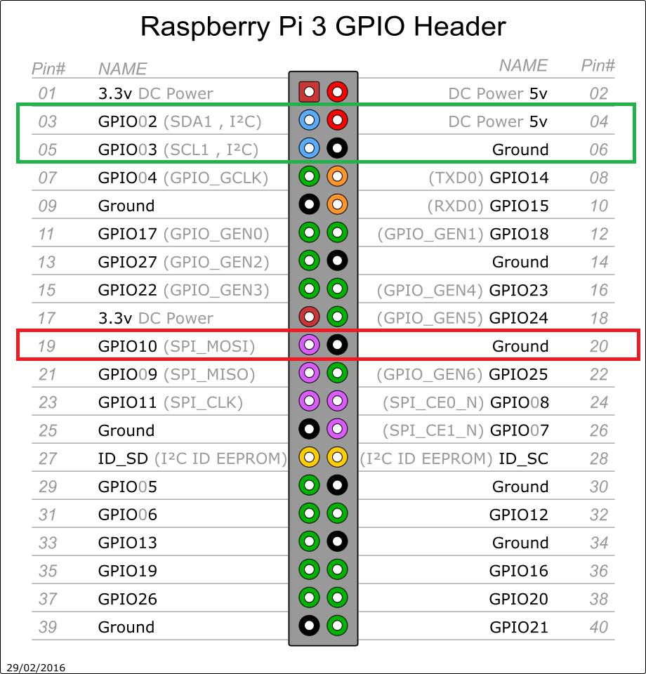

# Anweisungen zur Hardware-Einrichtung

## Stückliste

### Empfänger-Knoten (diese Liste ergibt einen Knoten, bis zu acht)

* 1 x [Arduino Nano](https://www.ebay.com/sch/i.html?_nkw=Arduino+Nano+V3.0+16M+5V+ATmega328P)
* 1 x [RX5808 Modul](https://www.banggood.com/search/rx5808-module.html) mit SPI mod (Module mit Datumscode 20120322 funktionieren bekanntermaßen)
* 3 x 1k-Ohm-Widerstand
* 1 x 100k-Ohm-Widerstand
* 26 AWG und 30 AWG Silikondraht

### Systemkomponenten

* 1 x Raspberry Pi3 (Pi2-Benutzer haben Probleme mit mehreren angeschlossenen Knoten gemeldet)
* 8 GB (Minimum) Micro-SD Karte
* 26 AWG und 30 AWG Silikonkabel (für die Verdrahtung zu jedem Empfängerknoten)
* 3D gedrucktes Gehäuse zur Aufnahme der Elektronik
* 5V-Stromversorgung, mindestens 3 Ampere (oder 12V-Stromversorgung, wenn bordeigene Regler verwendet werden)

### Zusätzliche Komponenten

* [HF-Abschirmung](Shielding%20and%20Course%20Position.md)

### Optionale Komponenten

* Ethernet-Kabel, 15 Meter plus
* Stromkabel für den Außenbereich, 15 Meter plus
* Netzwerk-Router
* Laptop/Tablett
* ws2812b LEDs

## Hardware-Einrichtung

### RX5808 Video-Empfänger

Stellen Sie sicher, dass Ihre Empfänger SPI unterstützen. *Wenn dies nicht der Fall ist, modifizieren Sie die RX5808-Empfänger wie folgt, um die SPI-Unterstützung zu aktivieren*. Die meisten heute erhältlichen RX5808-Module werden bereits mit aktiviertem SPI geliefert:

Entfernen Sie die Abschirmung vom RX5808, die Abschirmung wird normalerweise durch ein paar Lötpunkte an den Kanten gehalten. Verwenden Sie etwas Lötlotdocht, um das Lot zu entfernen und die Abschirmung vom Empfänger zu befreien. Achten Sie darauf, keine Massepads auf dem Empfänger zu beschädigen. In der Regel befinden sich am Rand kleine Löcher, mit denen Sie die Abschirmung leichter entfernen können.

Entfernen Sie den folgenden Widerstand:


Die Abschirmung sollte nach Entfernen des Widerstandes wieder angelötet werden.

### Empfänger-Knoten

Vollständige Verkabelung der Verbindungen zwischen jedem Arduino und RX5808.


Hinweis: Ein einfacher Empfängerknoten kann auch über USB konstruiert und angeschlossen werden -- siehe [doc/USB Nodes.md](USB%20Nodes.md).

### System-Baugruppe

Vollständige Verkabelung der Verbindungen zwischen jedem Arduino und der Raspberry Pi.

Hinweis: Vergewissern Sie sich, dass alle Empfänger-Knoten und die Raspberry Pi an eine gemeinsame Masse angeschlossen sind; wenn nicht, können die i2c-Nachrichten beschädigt werden.


### Hinzufügen einer gerichteten RF-Abschirmung

Eine gerichtete HF-Abschirmung verbessert die Fähigkeit des Systems zur Abwehr von Fehlpässen erheblich. Siehe [HF-Abschirmung](Shielding%20and%20Course%20Position.md)

### Echtzeituhr

Unter "[doc/Real Time Clock.md](Real%20Time%20Clock.md)" finden Sie weitere Informationen über die Installation eines Echtzeituhr-Moduls, mit dem das System das Datum und die Uhrzeit besser verwalten kann.

### WS2812b LED-Unterstützung

Die Stifte im grünen Kasten sind die, die bereits vom Timer verwendet wurden. An den Pins im roten Kasten schließen Sie das Signal und die Masse der ws2812b-LEDs an.  Die LEDs benötigen eine separate Stromquelle. Siehe WS2812b LED-Unterstützung unter [doc/Software Setup.md](Software%20Setup.md).



### Zusätzliche Sensoren

Sensoren (wie BME280 und INA219) können an den I2C-Bus und die Stromversorgungspins angeschlossen werden. Siehe die '..._sensor.py'-Dateien im Verzeichnis "src/interface" für Implementierungsbeispiele. Die Sensoren müssen in der Datei "src/server/config.json" spezifiziert werden -- in der Beispielkonfiguration unten wird ein BME280-Sensor an I2C-Adresse 0x76 (als "Klima") und INA219-Sensoren an 0x40 und 0x41 konfiguriert.

```
    "SENSOREN": {
            "i2c:0x76": {
                    "Name": "Klima": "Klima".
            },
            "i2c:0x40": {
                    "Name": "Batterie",
                    "max_current": 0.1
            },
            "i2c:0x41": {
                    "Name": "Pi",
                    "max_current": 2
            }
    },
```

### Mehrere Timer

Mehrere RotorHazard Timer können miteinander verbunden werden (d.h. für Split Timing und Spiegelung) -- siehe [doc/Cluster.md](Cluster.md).

---

Siehe auch:<br/>
[doc/USB-Knoten.md](USB%20Nodes.md)<br/>
[doc/Software Setup.md](Software%20Setup.md)<br/>
[doc/Benutzerhandbuch.md](User%20Guide.md)
