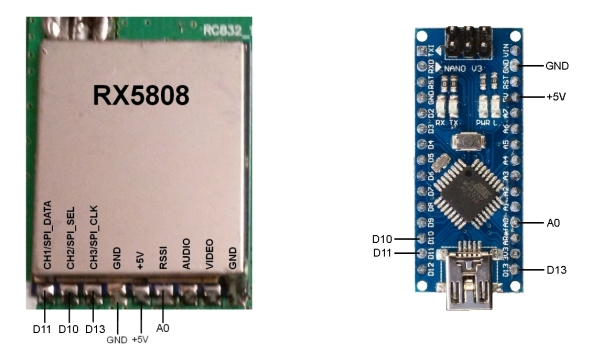

# Nodos USB

Los nodos de hardware pueden conectarse al sistema a través de USB. Se puede crear un nodo con un Arduino, un módulo RX5808 y seis cables; con las conexiones que se muestran a continuación.



La compilación anterior utiliza un módulo Arduino Nano V3.0 16M 5V ATmega328P (que se puede encontrar en [eBay](https://www.ebay.com/sch/i.html?_nkw=Arduino+Nano+V3.0+16M+5V+ATmega328P)) y un módulo RX5808 (que se puede encontrar en [banggood](https://www.banggood.com/search/rx5808-module.html) y [eBay](https://www.ebay.com/sch/i.html?_nkw=rx5808+module)).

Los nodos USB pueden conectarse a los puertos USB de Raspberry Pi en una construcción estándar del crono RotorHazard, o pueden conectarse a [cualquier ordenador que ejecute el servidor RotorHazard](Software%20Setup.md#otheros). Los nodos USB deben configurarse en la sección "SERIAL_PORTS" en el archivo "src/server/config.json".

#### Raspberry Pi

En la Raspberry Pi, se hará referencia a un nodo USB conectado con un nombre de puerto serie como "/dev/ttyUSB0". El comando ```ls/dev/ttyUSB*``` mostrará los puertos serie USB actuales. El archivo "src/server/config.json" debe contener una entrada como esta:
```
	"SERIAL_PORTS": ["/dev/ttyUSB0"],
```
Para más de un nodo USB se debería configurar así:
```
	"SERIAL_PORTS": ["/dev/ttyUSB0","/dev/ttyUSB1"],
```

####Ordenador con Windows

En un ordenador con Windows, se hará referencia a un nodo USB conectado con un nombre de puerto serie como "COM5". Los puertos actuales se pueden ver en el Administrador de dispositivos de Windows en "Puertos (COM y LPT)": cuando el nodo USB está enchufado, debe aparecer su entrada. Puede ser necesario instalar o actualizar su controlador (llamado algo así como "USB-SERIAL"). El archivo "src/server/config.json" debe contener una entrada como esta:
```
	"SERIAL_PORTS": ["COM5"],
```
Para más de un nodo USB se debería configurar así:
```
	"SERIAL_PORTS": ["COM5","COM6"],
```

<br/>

-----------------------------

Ver también:  
[doc/Hardware Setup.md](Hardware%20Setup.md)  
[doc/Software Setup.md](Software%20Setup.md)  
[doc/User Guide.md](User%20Guide.md)
